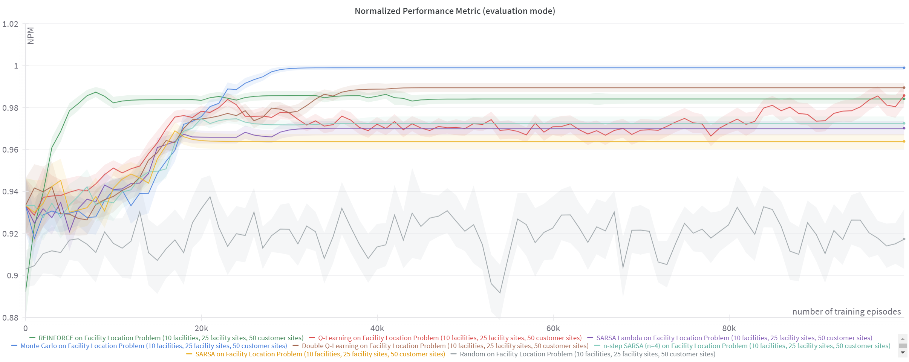
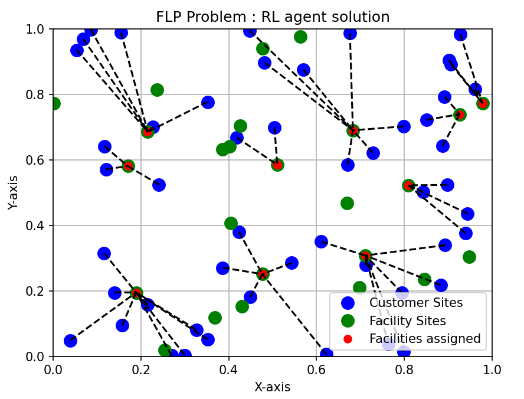

# RL for Operational Research

A framework for solving Operational Research problems with tabular RL algorithms.

<p align="center">
  
</p>

This was done in the tabular settings as a proof of concept that RL algorithm can be applied to various optimization problems, and that we could potentially extend the framework to Deep RL algorithms for more complex problems with bigger instances.

By Timothé Boulet, Pierre Prévot-Helloco and Alexandre Selvestrel


# Installation

Clone the repository, create a venv (advised), and install the requirements:

```bash
git clone git@github.com:tboulet/RL-for-Operational-Research.git
cd RL-for-Operational-Research
python -m venv venv
source venv/bin/activate  # on linux
venv\Scripts\activate  # on windows
pip install -r requirements.txt
```


# Run the code
 
For training your algorithms on a certain env, run the following command:

```bash
python run.py algo=<algo tag> env=<env tag>
```

For example, to train the random algorithm on the Knapsack environment:

```bash
python run.py algo=random env=knapsack
```

We use Hydra as our config system. The config folder is `./configs/`. You can modify the config (logging, metrics, number of training episodes) from the `default_config.yaml` file. You can also create your own config file and specify it with the `--config-name` argument :

```bash
python run.py algo=random env=knapsack --config-name=my_config_name
```

Advice : create an alias for the command above this.
# Algorithms
The algo tag should correspond to a configuration in ``configs/algo/`` where you can specify the algo and its hyperparameters. 

Currently, the following algorithms are available:
 - `random` : Random policy, a baseline that selects actions uniformly at random
 - `q` : Q-learning, an off-policy reinforcement learning algorithm that learns the optimal policy by estimating the optimal Q-values
 - `q_double` : Double Q-learning, an improvement of Q-learning that reduces overestimation of the Q-values with a double estimator
 - `sarsa` : SARSA algorithm, an on-policy reinforcement learning algorithm that learns the optimal policy by estimating the Q-values of the policy
 - `sarsa_n` : N-step SARSA, an improvement of SARSA that uses N-step returns to estimate the Q-values instead of just one step. It is a trade-off between the bias of one-step returns (Q Learning and SARSA) and the variance of Monte-Carlo returns
 - `sarsa_l` : SARSA(lambda), an improvement of SARSA that uses eligibility traces to update the Q-values. It is a trade-off between the bias of one-step returns (Q Learning and SARSA) and the variance of Monte-Carlo returns, but more flexible than N-step returns
 - `mc` : Monte-Carlo, a model-free reinforcement learning algorithm that learns the optimal policy by estimating the Q-values with Monte-Carlo returns
 - `reinforce` : REINFORCE, a policy gradient algorithm that learns the optimal policy by directly optimizing the policy

# Environments

The env tag should correspond to a configuration in ``configs/env/`` where you can specify the env and its hyperparameters.

Currently the following envs are implemented :
- `ks` : The Knapsack problem, where the agent has to select items to maximize the total value without exceeding the total weight
- `bp` : The Bin Packing problem, where the agent has to pack items in bins to minimize the number of bins used
- `flp` : The Facility Location Problem, where the agent has to open facilities to minimize the total cost of opening and the cost of serving the clients

The environments have usually several versions, a default (small), a `_medium` and a `_big` version, and sometimes a `_toy` one. The medium and large versions are used to test the scalability of the algorithms. They corresponds to bigger instances of the same problem, with for example more items in the Knapsack problem.

There is also a very simple `toy` environment, that is used for testing purposes, where the reward is simply 1 if a=s, with s and a taking value between 0 and n-1, with n a parameter. This can be considered as a deterministic (very simple) Bandit problem.

### Knapsack

The Knapsack problem is a combinatorial optimization problem where the agent has to select items to maximize the total value without exceeding the total weight. The environment is defined by the number of items, the maximum weight of the knapsack, the maximum value of the items, and the seed of the random generator.

### Bin Packing

The Bin Packing problem is a combinatorial optimization problem where the agent has to pack items in bins to minimize the number of bins used. The environment is defined by the number of items, the number of bins, the maximum size of the items, and the seed of the random generator.

### Facility Location Problem

<p align="center">
  
</p>

The Facility Location Problem is a combinatorial optimization problem where the agent has to open facilities to minimize the total cost of opening and the cost of serving the clients. The environment is defined by the number of facilities, the number of clients, the maximum cost of opening a facility, the maximum cost of serving a client, and the seed of the random generator.


# Visualisation and results

### WandB
WandB is a very powerful tool for logging. It is flexible, logs everything online, can be used to compare experiments or group those by dataset or algorithm, etc. You can also be several people to work on the same project and share the results directly on line. It is also very easy to use, and can be used with a few lines of code.

If `do_wandb` is True, the metrics will be logged in the project `wandb_config['project']` with entity `wandb_config['entity']`, and you can visualize the results on the WandB website.

### Tensorboard
Tensorboard is a tool that allows to visualize the training. It is usefull during the development phase, to check that everything is working as expected. It is also very easy to use, and can be used with a few lines of code.

If `do_tb` is True, you can visualize the logs by running the following command in the terminal.
```bash
tensorboard --logdir=tensorboard
```

### Render

If you have implemented a `render` method in your environment, it will be called every `frequency_episode` episodes, at a frequency of `frequency_step` steps, with a delay of `render_config` s.

### CLI

You can also visualize the results in the terminal. If `do_cli` is True, the metrics will be printed in the terminal every `cli_frequency_episode` episodes.

# Other

### Seed

You can specify the seed of the experiment with the `seed` argument. If you don't specify it, the seed will be randomly chosen.

### cProfile and SnakeViz

cProfile is a module that allows to profile the code. It is very useful to find bottlenecks in the code, and to optimize it. SnakeViz is a tool that allows to visualize the results of cProfile and so what you should focus. It is used through the terminal :

```bash
snakeviz logs/profile_stats.prof
```
